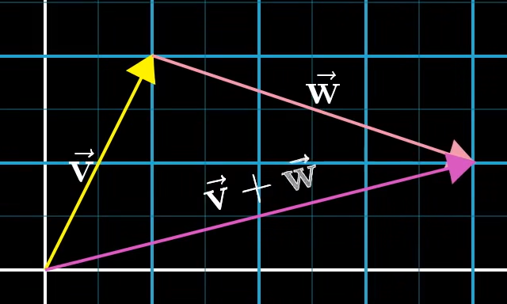
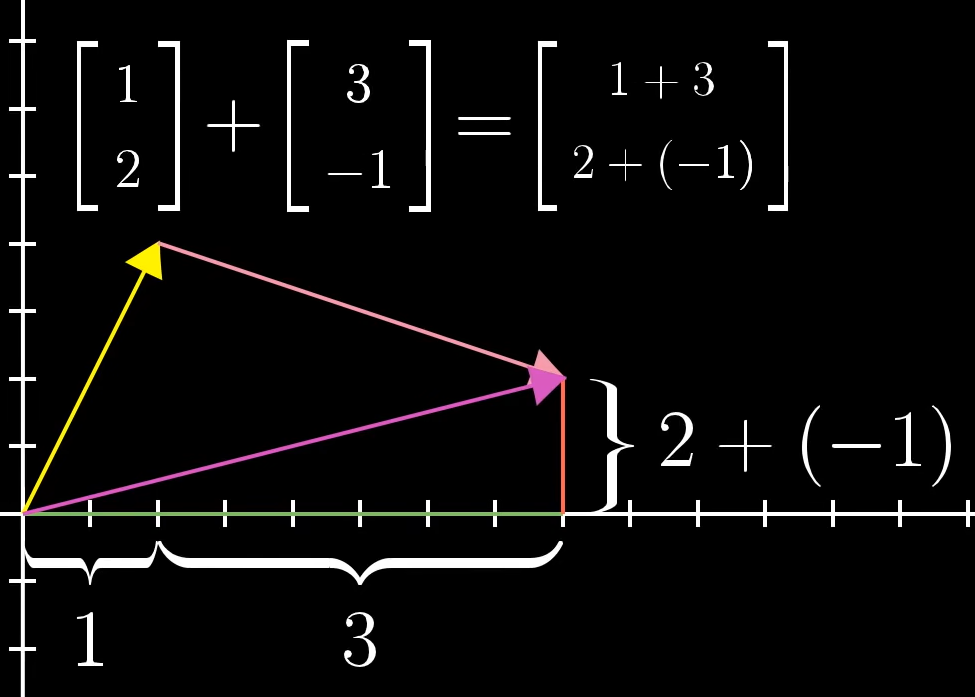

# [线性代数]( https://www.bilibili.com/video/BV1ys411472E/?share_source=copy_web&vd_source=205a97cd0eb85f22dca39cd31185a2c5)

## 向量 vector

几何上理解：有助于判断出解决具体问题需要用什么工具

物理上理解：数值上的理解有助于顺利利用这些工具

**向量：**

物理上：间中的箭头，有方向和距离，二维的，确定之后移动向量也不变

计算机：有序的数字列表

>向量加法和向量数乘贯穿线性代数始终

>向量加法
>
>
>
>
